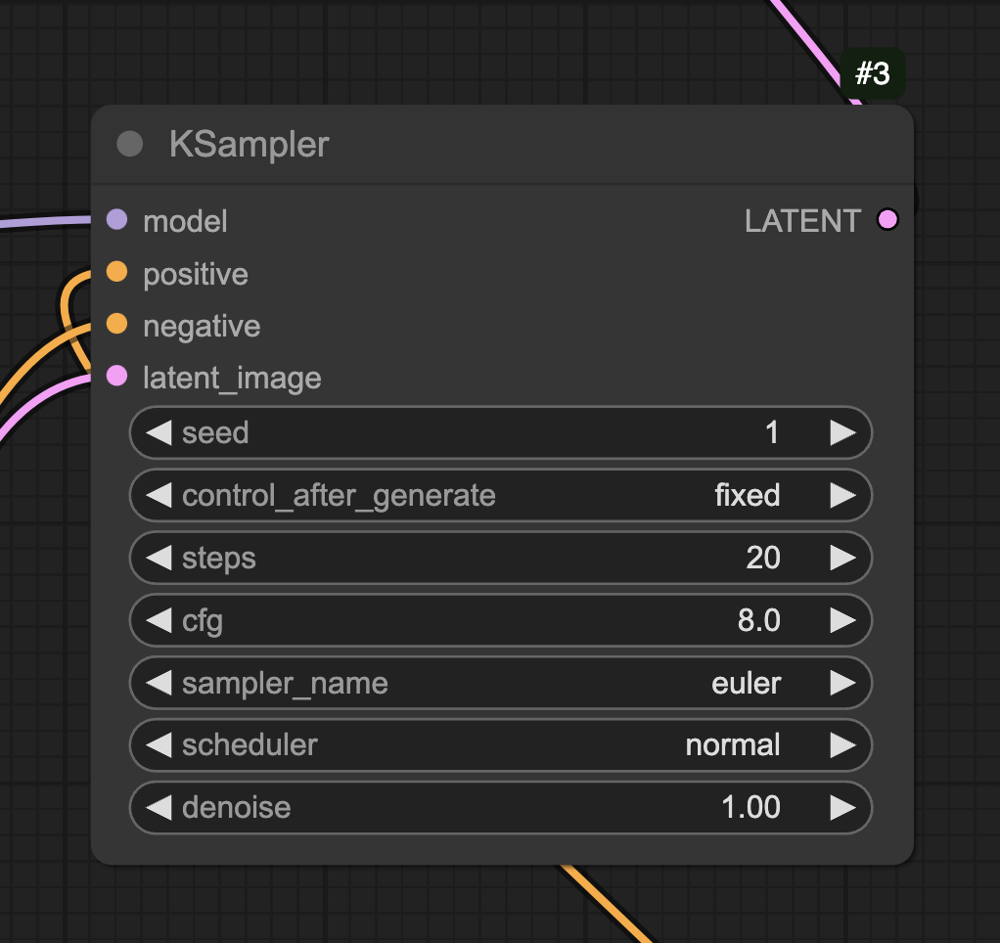

# p5.comfyui-helper.js

A library for p5.js which adds support for interacting with ComfyUI, using its API. It provides the following features:

* Submit ComfyUI workflows (saved in API format) from p5.js
* Modify various aspects of the workflow from within JavaScript
* Submit images or p5 drawing surfaces as inputs to workflows (e.g. for img2img, ...)
* Easy to use API that supports multiple outputs as well
* Works with promises or callbacks
* Fast (uses WebSocket instead of file transfers)

## Reference

- [Demo](#demo)
- [Prerequisites](#prerequisites)
- [Setup](#setup)
- [Getting started](#getting-started)
- [Examples](examples/)

## Demo

[Demo video](https://drive.google.com/file/d/1PmOk6OqwHU_6oGd50JQBHdjLdV_oLrdt/view?usp=sharing)

## Prerequisites

* [ComfyUI](https://github.com/comfyanonymous/ComfyUI) (tested with v0.2.4)
* If you are running your own ComfyUI installation:
    * Make sure to start Comfy with the following arguments: ```--listen 0.0.0.0 --enable-cors-header```
    * If the site you will be accessing Comfy from uses HTTPS, you will need to provision a certificate, and load it into ComfyUI with ```--tls-keyfile privkey.pem --tls-certfile fullchain.pem```. This is needed if you want to make use of the p5.js web editor.

## Setup

[Setup video](https://drive.google.com/file/d/16InuWI4nJpyUtFGbS6dUBLVXZadqM_OS/view?usp=drive_link)

* Install _comfyui-tooling-nodes_ (available to install via the ComfyUI Manager, or [manually](https://github.com/Acly/comfyui-tooling-nodes?tab=readme-ov-file#installation))
* Enable _Dev Mode_ in ComfyUI's setting (via the cog icon on the website), for the "Save (API format)" button to show.

## Getting started

Include the following line in the `head` section of your HTML:
```
<script src="https://unpkg.com/@gohai/p5.comfyui-helper@^1/libraries/p5.comfyui-helper.js"></script>
```

or, download and use a local copy of the [library file](https://github.com/gohai/p5.comfyui-helper/blob/main/libraries/p5.comfyui-helper.js) like so:

```
<script src="p5.comfyui-helper.js"></script>
```

#### Connecting to the ComfyUI instance

Create a global variable, and set up the `ComfyUiP5Helper` like so. The only argument is the URL you're using to access ComfyUI (with or without a slash at the end).

```
let comfy;

function setup() {
  comfy = new ComfyUiP5Helper("https://your.comfyui.instance:8188");
```

#### Loading a workflow

Save the desired workflow in ComfyUI by clicking the "Save (API Format)" button in the tool bar. (If you don't see this button, make sure that _Dev Mode_ is enabled in the settings accessible via the cog icon.)

This creates a JSON file that can be easily added to your p5.js project (e.g. by uploading it in the p5.js Web Editor), and loaded like so:

```
let workflow;

function preload() {
  workflow = loadJSON("workflow_api.json");
  console.log("workflow is", workflow);
}
```

The keys in this object correspond to the _#_ number ComfyUI shows at the top right of each node.



E.g. to change the seed of this KSampler node from within JavaScript, we'd do:

```
workflow[3].inputs.seed = random(999999);
```

#### Running a workflow

Submitting a workflow to ComfyUI's queue is as easy as calling its `run` method.

You can use this in two ways: either by passing a callback function as the second parameter.

```
comfy.run(workflow, gotImage);
```

This will call a function gotImage once the result are available:

```
function gotImage(results, error) {
  // ...
}
```

Alternatively, you can also use the `await` keyword to wait for the `run` method to eventually return the results:

```
let results = await comfy.run(workflow);
```

#### Receiving results

The `results` contains an array of objects, each with a `src` property and a `node` property. Use `src` with `loadImage()` to turn this into an image-type variable to be used for drawing.

```
let img;

function gotImage(results, error) {
  console.log(results);

  if (results.length > 0) {
    img = loadImage(results[0].src);
  }
}
``` 

The `node` property contains the id of the node that created the image.

#### Image inputs

Various types of workflows, such as image-to-image or inpainting, make use of existing images as part of the image generation.

The `image()` method is replacing any "Load Image" node (which loads an image from drive) by an image (or drawing context) variable in p5.js.

E.g.: the following image-to-image workflow has a "Load Image" as #10

```
let srcImg;

function preload() {
  srcImg = loadImage("example.png");
}

// ...
workflow[10] = comfy.image(srcImg);
```

```
let srcImg;

function setup() {
  createCanvas(512, 512);
  srcImg = createGraphics(width, height);
  srcImg.background(0);
  srcImg.fill("yellow");
  srcImg.circle(width/2, height/2, 100);

  // ...
  workflow[10] = comfy.image(srcImg);
}
```

The `mask()` method can be similarly used wherever the workflow contains a "Load Image (as mask)" node.
