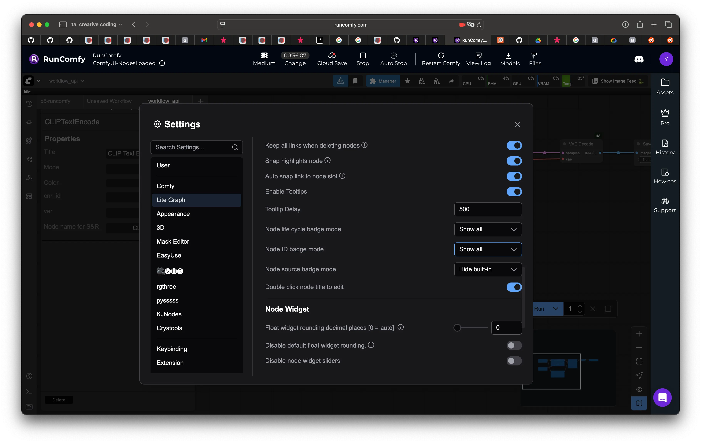

# p5.comfyui-helper.js

A library for p5.js which adds support for interacting with ComfyUI (or ComfyUI run on RunComfy), using its API. It provides the following features:

* Submit ComfyUI workflows (saved in API format) from p5.js
* Modify various aspects of the workflow from within JavaScript
* Submit images or p5 drawing surfaces as inputs to workflows (e.g. for img2img, ...)
* Easy to use API that supports multiple outputs as well
* Works with promises or callbacks

## Reference

- [Demo](#demo)
- [Prerequisites](#prerequisites)
- [Setup](#setup)
- [Getting started](#getting-started)
- [Examples](examples/)

## Demo

[Demo video](https://drive.google.com/file/d/1PmOk6OqwHU_6oGd50JQBHdjLdV_oLrdt/view?usp=sharing)

## Prerequisites

* RunComfy Machine

## Setup

[Setup video](https://drive.google.com/file/d/16InuWI4nJpyUtFGbS6dUBLVXZadqM_OS/view?usp=drive_link)

* Install _comfyui-tooling-nodes_ (available to install via the ComfyUI Manager, or [manually](https://github.com/Acly/comfyui-tooling-nodes?tab=readme-ov-file#installation))
* Enable _Dev Mode_ in ComfyUI's setting (via the cog icon on the website), for the "Save (API format)" button to show.


## Getting started

Include the following line in the `head` section of your HTML:
```
<script src="https://unpkg.com/@gohai/p5.comfyui-helper@^1/libraries/p5.comfyui-helper.js"></script>
```

or, download and use a local copy of the [library file](https://github.com/gohai/p5.comfyui-helper/blob/main/libraries/p5.comfyui-helper.js) like so:

```
<script src="p5.comfyui-helper.js"></script>
```

#### Connecting to the ComfyUI instance

Create a global variable, and set up the `ComfyUiP5Helper` like so. The only argument is the URL you're using to access ComfyUI (with or without a slash at the end).


For every new workflow/RunComfy session, you need to update the XXXXXXXX-XXXX-XXXX-XXXX-XXXXXXXXXXXX server-id since this updates every new work session
I would recommend setting your runcomfy session to be slightly longer than you anticipate so that you don't need to reset this url each time and wait for the 5 min load up period you can check that your url is correct, past <comfy_url> into your browser and it should display a ComfyUI instance without any RunComfy UI

```
let comfy;

function setup() {
  # below is an example URL
  # https://www.runcomfy.com/comfyui/89e60215-b0a1-4795-8437-e2743cddc806/servers/837eb0c1-c4f9-412a-befa-3921d368c130
  server_id = "837eb0c1-c4f9-412a-befa-3921d368c130";
  comfy_url = "https://" + server_id + "-comfyui.runcomfy.com";
  console.log("comfy url is " + comfy_url);
  comfy = new ComfyUiP5Helper(comfy_url); 
}
```

#### Loading a workflow

Save the desired workflow in ComfyUI by clicking the "Save (API Format)" button in the tool bar. (If you don't see this button, make sure that _Dev Mode_ is enabled in the settings accessible via the cog icon.)

This creates a JSON file that can be easily added to your p5.js project (e.g. by uploading it in the p5.js Web Editor), and loaded like so:

```
let workflow;

function preload() {
  workflow = loadJSON("workflow_api.json");
  console.log("workflow is", workflow);
}
```

##### Notes on loading a workflow:
- There's no correlation between the workflow in the runcomfy session and the workflow loaded here. I believe we are just using the session to load the workflow we've uploaded here. 
- Reminder: you can change certain fields in your workflow (random seed, prompt, etc) from p5.js
- IMPORTANT: this json must be obtained from turning dev mode on and saving the workflow as api format


The keys in this object correspond to the _#_ number ComfyUI shows at the top right of each node.
On RunComfy, we turn on the node numbers via the Lite Graph setting menu and scroll to the Node ID Badge mode and select 'Show All'. See the reference image.



E.g. to change the seed of this KSampler node from within JavaScript, we'd do:

```
workflow[3].inputs.seed = random(999999);
```

#### Running a workflow

Submitting a workflow to ComfyUI's queue is as easy as calling its `run` method.

You can use this in two ways: either by passing a callback function as the second parameter.

```
comfy.run(workflow, gotImage);
```

This will call a function gotImage once the result are available:

```
function gotImage(results, error) {
  // ...
}
```

Alternatively, you can also use the `await` keyword to wait for the `run` method to eventually return the results:

```
let results = await comfy.run(workflow);
```

You can also add a third (optional) parameter to receive status updates while the workflow is running:

```
comfy.run(workflow, gotImage, gotStatus);

function gotStatus(status){
  console.log(status);
}
```

#### Receiving results

The `results` contains an array of objects, each with a `src` property and a `node` property. Use `src` with `loadImage()` to turn this into an image-type variable to be used for drawing.

```
let img;

function gotImage(results, error) {
  console.log(results);

  if (results.length > 0) {
    img = loadImage(results[0].src);
  }
}
``` 

The `node` property contains the id of the node that created the image.

#### Image inputs

Various types of workflows, such as image-to-image or inpainting, make use of existing images as part of the image generation.

The `image()` method is replacing any "Load Image" node (which loads an image from drive) by an image (or drawing context) variable in p5.js.

E.g.: the following image-to-image workflow has a "Load Image" as #10

```
let srcImg;

function preload() {
  srcImg = loadImage("example.png");
}

// ...
workflow[10] = comfy.image(srcImg);
```

```
let srcImg;

function setup() {
  createCanvas(512, 512);
  srcImg = createGraphics(width, height);
  srcImg.background(0);
  srcImg.fill("yellow");
  srcImg.circle(width/2, height/2, 100);

  // ...
  workflow[10] = comfy.image(srcImg);
}
```

The `mask()` method can be similarly used wherever the workflow contains a "Load Image (as mask)" node.


## Web Templates
COMING SOON
*please duplicate the templates*
### p5.js
[comfyui-basic on p5.js editor](https://editor.p5js.org/loriechen333/sketches/DM99sXFz6)
WIP [comfyui-img2img on p5.js editor](https://editor.p5js.org/loriechen333/sketches/Ebnim8xcR)
WIP [comfyui-inpaint on p5.js editor](https://editor.p5js.org/loriechen333/sketches/LmKeEqXun)

### OpenProcessing (coming soon)


#### Credits
Original library created by Gottfried Haider [original repo](https://github.com/gohai/p5.comfyui-helper)

Additional RunComfy changes made by Lorie Chen during her TA-ship for Golan Levin's Creative Coding 60-212 course at CMU.

Up to date for RunComfy's ComfyUI feature as of 09.29.2025